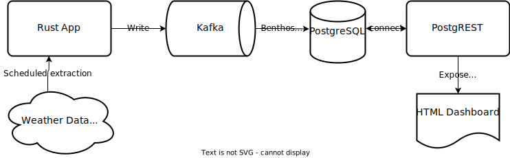

# forecast-monitor

System to observe weather forecasts over time. Architecture:



_Note:_ with the volume of incoming data as it is currently configured, this system could be simplified where data from APIs would be written directly to Postgres instead fo Kafka.

## Configuration

### Collector config

```
cp _config.yaml config.yaml
```

and insert required values. [weatherapi.com](https://www.weatherapi.com/) and [tomorrow.io](https://www.tomorrow.io/weather-api/) require registration to obtain API keys.

### Collector build

```
docker build -t forecasts .
```

### Frontend config

If this is deployed on a server, `postgrest` endpoint need to be adjusted in [viz.js](site/viz.js). Firewall must be open for ports `3000` and `8080` for IPs from which dashboard should be accessed.

### Run

```
docker-compose up
```
